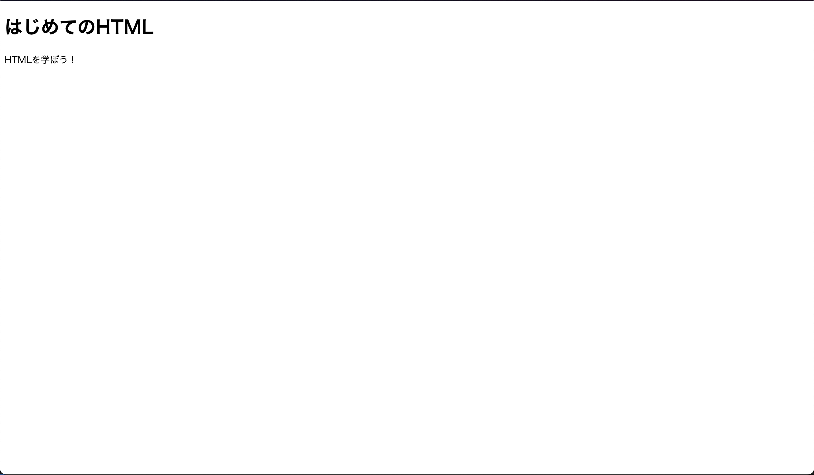
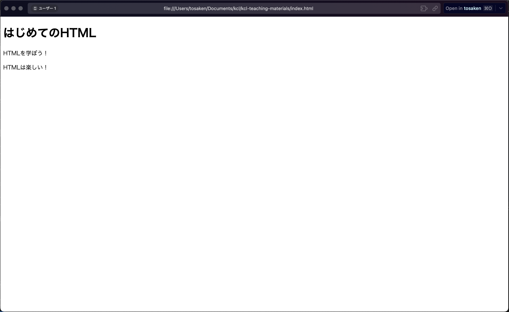
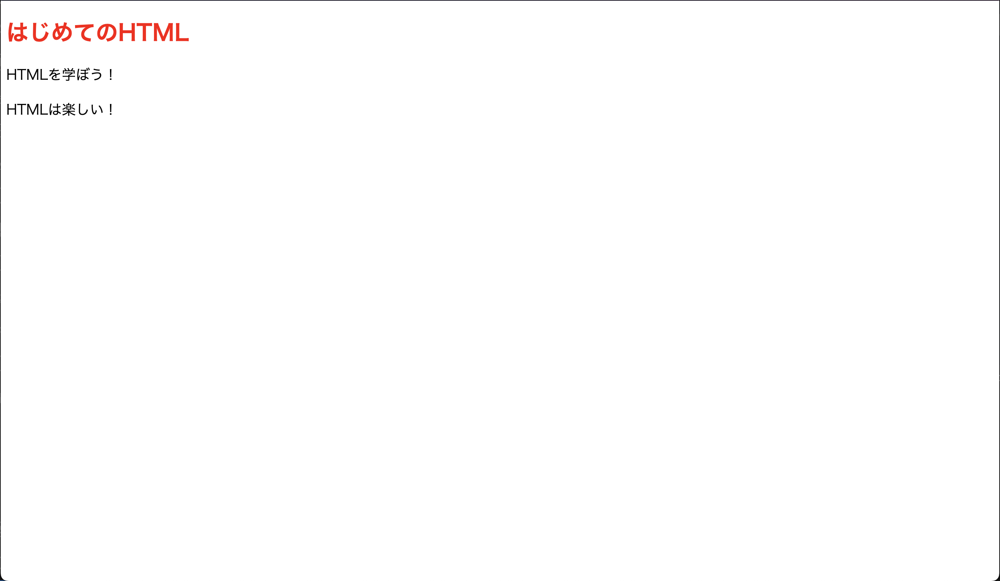
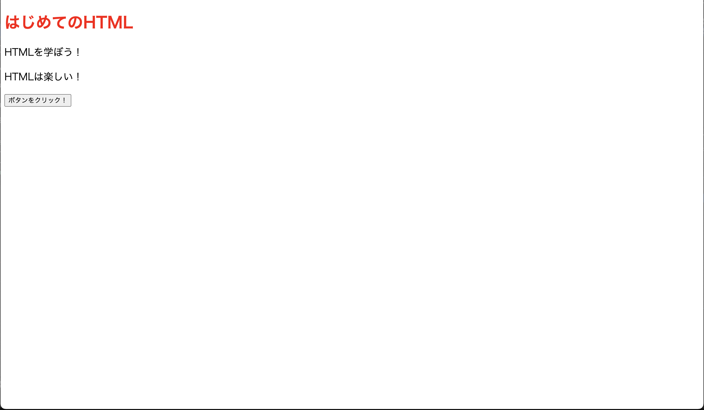
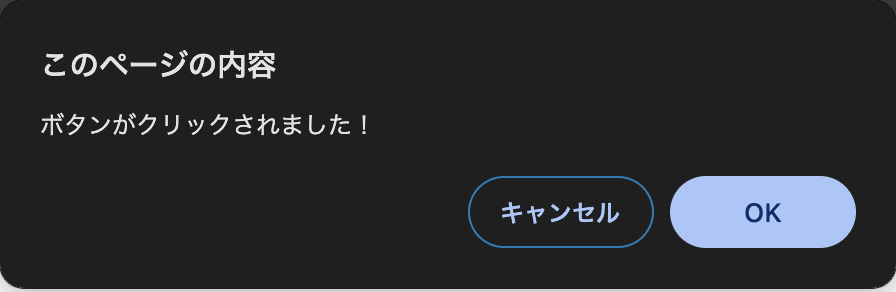

# はじめに

このドキュメントでは web サイトを作るにあたって必要な知識を学びます。

## ウェブサイトとは

ウェブサイトとは、インターネット上に公開されている情報を閲覧するためのページのことです。

ウェブサイトは、HTML、CSS、JavaScript などの技術を使用して作成されます。

HTML は、ウェブサイトの**構造**を定義するための言語です。

CSS は、ウェブサイトの**デザイン**を定義するための言語です。

JavaScript は、ウェブサイトの**動作**を定義するためのプログラミング言語です。

まずは、これらの言語について学びましょう。

# HTML とは

`HTML（HyperText Markup Language）`は、ウェブページの構造を定義するための言語です。

HTML は、タグ（`<tag>`）を使用して要素を定義します。

まずは実際に HTML を書いてみましょう。

新規にファイルを作成します。

ファイルを作成する場所は、任意の場所で構いません。

ファイル名は、`index.html`とします。

ファイルの中身を以下のように記述します。

```html
<!DOCTYPE html>
<html>
  <head>
    <title>はじめてのHTML</title>
  </head>
  <body>
    <h1>はじめてのHTML</h1>
    <p>HTMLを学ぼう！</p>
  </body>
</html>
```

この HTML ファイルをブラウザで開いてみましょう。

以下のような表示がされれば成功です。



ブラウザのタブを見てみると、タイトルが`はじめてのHTML`になっていることがわかります。


試しに先ほどの HTML ファイルを以下のように変更してみましょう。

```html
<!DOCTYPE html>
<html>
  <head>
    <title>はじめてのHTML</title>
  </head>
  <body>
    <h1>はじめてのHTML</h1>
    <p>HTMLを学ぼう！</p>
    <p>HTMLは楽しい！</p>
  </body>
</html>
```

ブラウザをリロードすると、以下のように表示が変わっていることがわかります。



このように、HTML ファイルを変更することで、ブラウザ上で表示を変更することができます。

最初なので、簡単な HTML ファイルを作成しましたが、実際のウェブサイトはもっと複雑な HTML ファイルで構成されています。

先ほど書いた html ファイルの構造を説明します。

- `<!DOCTYPE html>`: HTML ドキュメントのバージョンを指定します。

HTML にもバージョンがあり、`<!DOCTYPE html>`は HTML5 のバージョンを指定しています。

- `<html>`: HTML ドキュメント全体を囲む要素です。

これにより、HTML ドキュメントの開始と終了を示します。

- `<head>`: HTML ドキュメントのヘッダーを定義します。

ヘッダーには、タイトルやスタイルシート、スクリプトなどが含まれます。

例えば、`<title>`要素は、ブラウザのタブに表示されるタイトルを定義します。

以下の部分


- `<body>`: HTML ドキュメントの本文を定義します。

本文には、テキストや画像、リンクなどが含まれます。

例えば、`<h1>`要素は、**見出し**を定義します。

見出しに使うタグは様々ありますがここでは h1 のみの説明とします。

- `<p>`: HTML ドキュメントの段落を定義します。

p タグは最もよく使われるタグの一つです。

このように、HTML はタグを使って要素を定義します。

html のタグはおよそ 100 種類以上ありますが、ここではその一部を示しました。

このドキュメントを進めていくにつれて、他のタグについても学んでいきます。

基本的にブラウザ上に表示される要素は body 内に記述します。

# CSS とは

次に `CSS（Cascading Style Sheets）`について学びます。

CSS は、ウェブページのデザインを定義するための言語です。

CSS は、HTML の要素にスタイルを適用することができます。

先ほどの HTML ファイルでは、HTML の要素にスタイルを適用していませんでした。

そのため見た目がデフォルトのものになっていました。

テキストの色やサイズを変えたり、文字に動きをつけたりすることができます。

CSS は HTML ファイル内に記述することもできますが、別ファイルとして保存することが一般的です。

まずは、CSS を HTML ファイル内に記述してみましょう。

先ほどの HTML ファイルに以下のように CSS を記述します。

```html
<!DOCTYPE html>
<html>
  <head>
    <title>はじめてのHTML</title>
    <style>
      h1 {
        color: red;
      }
      p {
        font-size: 20px;
      }
    </style>
  </head>
  <body>
    <h1>はじめてのHTML</h1>
    <p>HTMLを学ぼう！</p>
    <p>HTMLは楽しい！</p>
  </body>
</html>
```

この CSS は、`<style>`タグ内に記述されています。

`<style>`タグは、HTML ドキュメント内に CSS を記述するためのタグです。

`<style>`タグ内に CSS を記述することで、HTML の要素にスタイルを適用することができます。



`はじめてのHTML`という文字が赤色になり、`HTMLを学ぼう！`と`HTMLは楽しい！`の文字が大きくなっていることがわかります。

では次に、CSS を別ファイルとして保存してみましょう。

`index.html`と同じディレクトリに`style.css`というファイルを作成します。

`style.css`に以下のように CSS を記述します。

```css
h1 {
  color: red;
}
p {
  font-size: 20px;
}
```

そして、`index.html`の`<style>`タグ内の CSS を削除します。

`<link>`タグを使って`style.css`を読み込むようにします。

`<link>`タグは、外部ファイルを読み込むためのタグです。

外部ファイルはローカルに保存されているファイルだけではなくインターネット上にあるファイルも読み込むことができます

```html
<!DOCTYPE html>
<html>
  <head>
    <title>はじめてのHTML</title>
    <link rel="stylesheet" href="style.css" />
  </head>
  <body>
    <h1>はじめてのHTML</h1>
    <p>HTMLを学ぼう！</p>
    <p>HTMLは楽しい！</p>
  </body>
</html>
```

いろいろ気になる点があると思いますがまずは表示結果を見てみましょう


先ほどと同じ表示になっていることがわかります。

html ファイルに新しく追加した`<link>`タグは、`style.css`を読み込むためのタグです。

`rel`属性には`stylesheet`という値を指定します。

これは、読み込むファイルがスタイルシート(CSS)であることを示しています。

`href`属性には、読み込むファイルのパスを指定します。

ここでは同じディレクトリにある`style.css`を読み込むように指定しています。

このように、CSS を別ファイルとして保存することで、HTML ファイルと CSS ファイルを分離することができます。

# JavaScript とは

では最後に`JavaScript`について学びます。

JavaScript とは、ウェブページの動作を定義するためのプログラミング言語です。

Java とは異なる言語であり、名前が似ているだけで全く別の言語です。

JavaScript は CSS と同様に HTML ファイル内に記述することもできますが、別ファイルとして保存することが一般的です。

まずは、JavaScript を HTML ファイル内に記述してみましょう。

先ほどの HTML ファイルに以下のように JavaScript を記述します。

```html
<!DOCTYPE html>
<html>
  <head>
    <title>はじめてのHTML</title>
    <link rel="stylesheet" href="style.css" />
  </head>
  <body>
    <h1>はじめてのHTML</h1>
    <p>HTMLを学ぼう！</p>
    <p>HTMLは楽しい！</p>
    <button onclick="handleClick">ボタンをクリック！</button>
  </body>
  <script>
    function handleClick() {
      alert("ボタンがクリックされました！");
    }
  </script>
</html>
```



`ボタンをクリック！`というボタンをクリックすると、アラートが表示されることがわかります。



この JavaScript は、`<script>`タグ内に記述されています。

`<script>`タグは、HTML ドキュメント内に JavaScript を記述するためのタグです。

`<script>`タグ内に JavaScript を記述することで、HTML ファイル内で JavaScript を実行することができます。

この script タグの中で`handleClick`という関数を定義しています。

この関数は、ボタンがクリックされたときに呼び出される関数です。

alert 関数はアラートを表示するための関数でユーザーは OK ボタンを押すまで次の処理に進むことができません。

では次に、JavaScript を別ファイルとして保存してみましょう。

`index.html`と同じディレクトリに`script.js`というファイルを作成します。

`script.js`に以下のように JavaScript を記述します。

```javascript
function handleClick() {
  alert("ボタンがクリックされました！");
}
```

そして、`index.html`の`<script>`タグ内の JavaScript を削除します。

`<script>`タグを使って`script.js`を読み込むようにします。

```html
<!DOCTYPE html>
<html>
  <head>
    <title>はじめてのHTML</title>
    <link rel="stylesheet" href="style.css" />
    <script src="script.js"></script>
  </head>
  <body>
    <h1>はじめてのHTML</h1>
    <p>HTMLを学ぼう！</p>
    <p>HTMLは楽しい！</p>
    <button onclick="handleClick()">ボタンをクリック！</button>
  </body>
</html>
```

先ほどと同じ表示になっていることがわかります。

この script タグの中で`script.js`を読み込むようにしています。

src 属性を使うことで、外部ファイルを読み込むことができます。

このように、JavaScript を別ファイルとして保存することで、HTML ファイルと JavaScript ファイルを分離することができます。

# まとめ

この章では、ウェブサイトを作るために必要な HTML、CSS、JavaScript について学びました。

この章で扱った内容は、ウェブサイトを作るための基本的な知識です。

今後の章では多種多様なタグや css のプロパティ、javascript の機能について学んでいきます。

それでは次の章に進みましょう。

[./step-2.md](./step-2.md)
