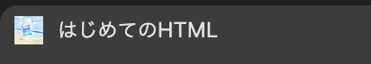
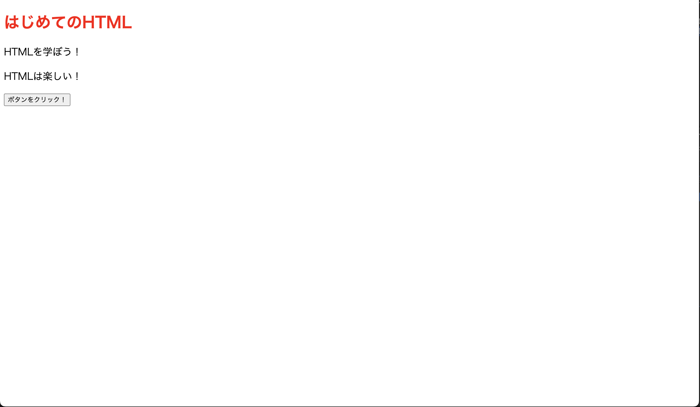
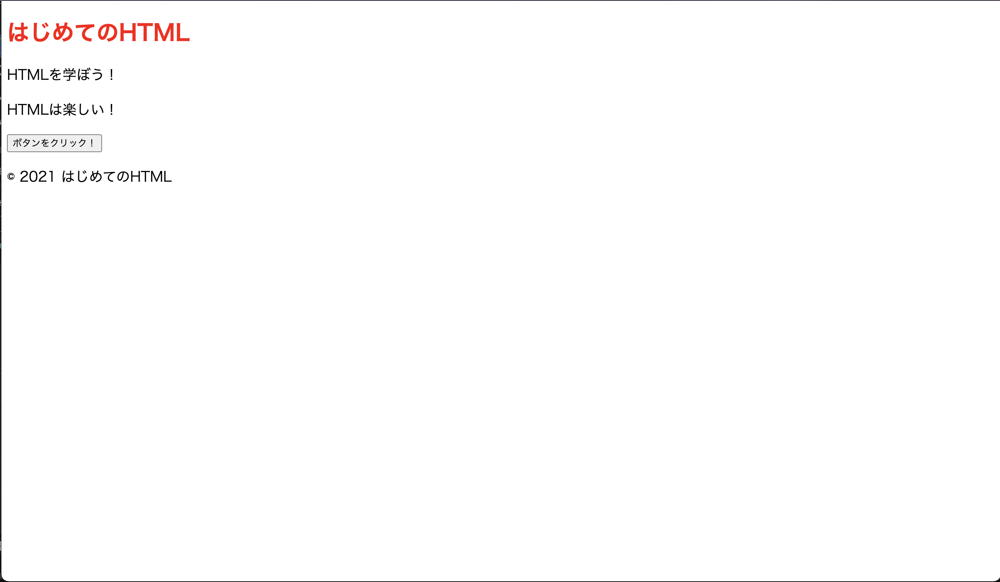

# HTML を学ぶ

第 2 章では第 1 章で触れた HTML の書き方をもう少し詳しく説明します。

## HTML における`要素`とは

HTML では次のような文字列がたくさん現れます

```
<p></p>
```

これらは次のように呼ばれます

<p> `開始タグ`

</p> `終了タグ`

<p></p> `pタグ`または`p要素`

またこの`p`は可変であり様々なものに置き換わります。

どのようなものに変わるかは今後取り扱っていきます。

また次のような記述を追加することもあります

```
<p id="sample" class="text">
  sample text
</p>
```

`id`と `class`が追加されました

これらは`属性`(または`プロパティ`)と呼ばれ要素に効果を持たせることができます。

ここでは `sample`という id を付与したり、 `text`という css クラスを適用したりしています。

## HTML の基本構造

HTML は以下のような構造を持っています。

```html
<!DOCTYPE html>
<html>
  <head>
    <! -- ここにヘッダー情報を記述します -->
    <! -- 画面には直接は現れない情報を記述します -->
  </head>
  <body>
    <! -- ここにコンテンツを記述します -->
    <! -- 画面に表示される情報を記述します -->
  </body>
</html>
```

まずは head についてみてみましょう

## head タグ

head タグは、画面には直接は現れない情報を記述するタグです。

head タグの中には、以下のような情報を記述することができます。

- ページのタイトル
- ページの説明
- CSS ファイルのリンク
- JavaScript ファイルのリンク
- その他のメタ情報
- - OG 画像(twitter などにリンクを貼ったときに表示される画像)
- - favicon(ブラウザのタブに表示されるアイコン)

head タグは以下のように記述します。

```html
<head>
  <title>ページのタイトル</title>
  <meta name="description" content="ページの説明" />
  <link rel="stylesheet" href="style.css" />
  <script src="script.js"></script>
  <link rel="icon" href="favicon.ico" />
</head>
```

いろいろ出てきてわからない単語があるかもしれませんが、順番に説明していきます。

### title タグ

1 章でも記述しましたが、title タグはページのタイトルを記述するためのタグです。

title タグの中に記述した文字列がブラウザのタブに表示されます。

### meta タグ

meta タグは、ページの説明やその他のメタ情報を記述するためのタグです。

meta タグには、name 属性や content 属性を指定することができます。

name 属性には、メタ情報の種類を指定します。

content 属性には、メタ情報の内容を指定します。

これらを正しく記述することで、検索エンジンなどが正しく情報を取得することができます。(google などで検索したときに表示される情報)

俗に言う SEO 対策の一環です。

### link タグ

`link`タグは、外部ファイルを読み込むためのタグです。

`rel`属性には、リンクの種類を指定します。

ex:

- stylesheet(css ファイル)
- icon(ブラウザに表示するアイコン)
- etc...

href 属性には、リンク先の`URL`を指定します。

ここでは`favicon.ico`というファイルを読み込んでいます。

これは、ブラウザのタブに表示されるアイコンです。

github では以下のようなアイコンが表示されます


### script タグ

`script`タグは`javascript`を定義するためのタグです。

src 属性にファイルのパスを指定することで外部ファイルを読み込むことができます。

script タグの中に直接 javascript を記述することもできます。

```html
<script>
  console.log("Hello World!");
</script>
```

`console.log`はコンソールに文字列を出力するための関数です。

ではこれらの情報を使って`step1`で作った html ファイルを書き換えてみましょう。

```html
<!DOCTYPE html>
<html>
  <head>
    <title>はじめてのHTML</title>
    <meta name="description" content="HTMLを学ぼう！" />
    <link rel="stylesheet" href="style.css" />
    <script src="script.js"></script>
    <link rel="icon" href="favicon.ico" />
  </head>
  <body>
    <h1>はじめてのHTML</h1>
    <p>HTMLを学ぼう！</p>
    <p>HTMLは楽しい！</p>
    <button onclick="handleClick()">ボタンをクリック！</button>
  </body>
</html>
```

`favicon.ico`ファイルを作成して、`index.html`と同じディレクトリに配置してみましょう。

`favicon.ico`はこのリポジトリの`step2`ディレクトリに配置されています。

ブラウザの表示を更新してみると、タブにアイコンが表示されることがわかります。



meta タグの内容の変更はローカルファイルでは直接確認することができませんが、今後それが確認できる章があるので、そのときに確認してみてください。

## body タグ

body タグは、画面に表示される情報を記述するためのタグです。

body タグの中には、以下のような情報を記述することができます。

- ヘッダー
- フッター
- ページの見出し
- ページの本文
- 画像
- ボタン
- リンク
- その他のコンテンツ
- - 表
- - 入力フォーム

全てを説明すると長くなるのでここでは主要なものを説明します

### header タグ

`header`タグは、ページのヘッダーを定義するためのタグです。

ヘッダーとはページの上部に表示される情報のことです。

ヘッダーには、以下のような情報を記述する時に使うことが多いです。

- ロゴ
- サービス名
- 特定のページへのリンク
- ナビゲーションメニュー

`header`タグは以下のように記述します。

index.html に以下のように記述してみましょう

```html
<body>
  <header>
    <h1>はじめてのHTML</h1>
  </header>
  <main>
    <p>HTMLを学ぼう！</p>
    <p>HTMLは楽しい！</p>
    <button onclick="handleClick()">ボタンをクリック！</button>
  </main>
</body>
```



ブラウザを確認してもぱっと見大きな変化はありませんが、これで`header`タグを使うことができるようになりました。

見た目の変化がなくても HTML の構造を意識することで、後々の CSS や JavaScript の実装がしやすくなります。

### main タグ

`main`タグは、ページのメインコンテンツを定義するためのタグです。

メインコンテンツとはページの中心に表示される情報のことです。

先ほど変更した index.html では`はじめてのHTML`が`header`タグに、`HTMLを学ぼう！`と`HTMLは楽しい！`が`main`タグにそれぞれ記述されています。

つまり、ここでは`はじめてのHTML`がページのタイトルであり、`HTMLを学ぼう！`と`HTMLは楽しい！`がメインコンテンツとなります。

### footer タグ

次に`footer`タグを紹介します。

footer タグとは、ページのフッターを定義するためのタグです。

フッターとはページの下部に表示される情報のことです。(header の対極)

`index.html`に以下のように記述してみましょう

```html
<body>
  <header>
    <h1>はじめてのHTML</h1>
  </header>
  <main>
    <p>HTMLを学ぼう！</p>
    <p>HTMLは楽しい！</p>
    <button onclick="handleClick()">ボタンをクリック！</button>
  </main>
  <footer>
    <p>&copy; 2021 はじめてのHTML</p>
  </footer>
</body>
```



新しく`footer`タグを追加し、その中に`&copy; 2021 はじめてのHTML`という文字列が表示されているのがわかります。

`&copy;`は著作権記号を表す特殊文字です。

このように`footer`タグを使うことで、ページの下部に著作権情報などを表示することができます。

footer には他に次のような情報を記述することが多いです。

- サイトの運営者情報
- プライバシーポリシー
- お問い合わせ先
- サイトの利用規約
- ...etc

### p タグ

`p`タグは、段落を定義するためのタグです。

段落とは文章の区切りを表すもので、通常は文章の最初に空白行を入れることで段落を表します。

html では`p`タグを使うことで段落を表すことができます。

index.html ではすでに`p`タグを使っているため、ここでは加筆することはしません。

### button タグ

`button`タグは、ボタンを定義するためのタグです。

ボタンはその名の通りユーザーがクリックすることができる要素です。

index.html ではすでに`ボタンをクリック！`というボタンが表示されています。

このボタンをクリックすると`handleClick`という関数が呼び出されるようになっています。

この関数は`script.js`内に記述されています。

### img タグ

`img`タグは、画像(image)を表示するためのタグです。

`img`タグには`src`属性を指定することで画像のパスを指定することができます。

`alt`属性には画像の説明を記述することができます。

これにより画像が表示されない場合や、視覚障害のあるユーザーにも画像の内容を伝えることができます。

そのため、`alt`属性は必ず指定するようにしましょう。

index.html に以下のように記述してみましょう

```html
<body>
  <header>
    <h1>はじめてのHTML</h1>
  </header>
  <main>
    <p>HTMLを学ぼう！</p>
    <p>HTMLは楽しい！</p>
    <button onclick="handleClick()">ボタンをクリック！</button>
    
  </main>
  <footer>
    <p>&copy; 2021 はじめてのHTML</p>
  </footer>
</body>
```


`img`タグを追加することで、`150x150の画像`という画像が表示されるようになりました。

`src`属性には画像の URL を指定することができます。

ここでは`https://placehold.jp/150x150.png`という URL を指定しています。

ローカルファイルも指定することが出来るため、自分で用意した画像を表示することも可能です。

# まとめ

この章では HTML の基本的な使い方について学びました。

ここで扱った要素はごく一部であり、HTML を書く上ではたくさんのタグ、属性を使用します。

次の章では css に関して学んでいきます。

それでは次の章に進みましょう
