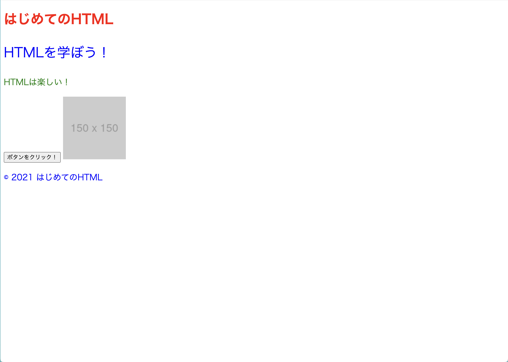

# CSS を学ぶ

第 3 章では第 1 章で触れた CSS の書き方をもう少し詳しく説明します。

## CSS の書き方を学ぶ

第 1 章でも触れましたが css は基本的には以下のような書き方をします

```css
h1 {
  color: red;
}
p {
  font-size: 20px;
}
```

ここで書いている内容は主に次のような内容になっています

```
`適用するタグ h1` {
  `適用するプロパティ名 color(テキストの色)`: `適用する値 red(赤)`
}

`適用するタグ p` {
  `適用するプロパティ名 font-size(テキストのサイズ)`: `適用する値 20px`
}
```

適用するプロパティの種類は数多く存在するため、一気に覚えようとせずに使うときに都度調べて覚えましょう。

## CSS selector について

さていきなりですが style.css を次のように変更して見ましょう

```css
h1 {
  color: red;
}
p {
  font-size: 20px;
  color: blue;
}
```

index.html を開くと次のような画面に変わっていることがわかります


`HTMLを学ぼう！` `HTMLは楽しい！` `2021 はじめてのHTML`が全て青色に変わったことが見て取れます。

これは新たに `color: blue;`を追加したからです。

前述した通り`color`プロパティは文字色の変更をすることができます。

しかし`HTMLは楽しい！`だけ緑色に変えたい！という場合はどうしましょうか。

そんなときに使えるのが class selector です。

css には css selector と呼ばれる`どの要素に`スタイルを定義するかを決める記述が存在します

上記の css における`h1`も type selector と呼ばれる css selector の一種です。

### class selector

class selector は次のような書き方で記述することができます

```css
.green-text {
  color: green;
}
```

selector の前に`.`をつけるだけです。

これを style.css に追加して見ましょう

```css
h1 {
  color: red;
}
p {
  font-size: 20px;
}
.green-text {
  color: green;
}
```

そして index.html を次のように変更します。

```html
<!DOCTYPE html>
<html>
  <head>
    <title>はじめてのHTML</title>
    <meta name="description" content="HTMLを学ぼう！" />
    <link rel="stylesheet" href="style.css" />
    <script src="script.js"></script>
    <link rel="icon" href="favicon.ico" />
  </head>
  <body>
    <header>
      <h1>はじめてのHTML</h1>
    </header>
    <main>
      <p>HTMLを学ぼう！</p>
      <p class="green-text">HTMLは楽しい！</p>
      <button onclick="handleClick()">ボタンをクリック！</button>
      
    </main>
    <footer>
      <p>&copy; 2021 はじめてのHTML</p>
    </footer>
  </body>
</html>
```

無事`HTMLは楽しい!`だけ色を緑にすることができました


### id selector

では次に id selector です

これは特定の id 属性が付与されている要素に対してのみ適用することができる selector です

id selector は次のように書くことができます。

```css
#learn-html {
  font-size: 32px;
}
```

selector の前に`#`をつけるだけです

これを style.css に追加して見ましょう

```css
h1 {
  color: red;
}
p {
  font-size: 20px;
}
.green-text {
  color: green;
}
#learn-html {
  font-size: 32px;
}
```

また index.html を次のように編集します

```html
<!DOCTYPE html>
<html>
  <head>
    <title>はじめてのHTML</title>
    <meta name="description" content="HTMLを学ぼう！" />
    <link rel="stylesheet" href="style.css" />
    <script src="script.js"></script>
    <link rel="icon" href="favicon.ico" />
  </head>
  <body>
    <header>
      <h1>はじめてのHTML</h1>
    </header>
    <main>
      <p id="learn-html">HTMLを学ぼう！</p>
      <p class="green-text">HTMLは楽しい！</p>
      <button onclick="handleClick()">ボタンをクリック！</button>
      
    </main>
    <footer>
      <p>&copy; 2021 はじめてのHTML</p>
    </footer>
  </body>
</html>
```

`HTMLを学ぼう!`だけ文字が大きくなったのが確認できたと思います。



### selector の強さ

さてこれで以下の３つの selector を学びました

- type selector
- class selector
- id selector

ではこれらはどのような強さを持つでしょうか。

強さという抽象的な言葉だとわかりにくいので次の場合を考えて見ましょう

```css
#sample-text {
  color: yellow;
}

.green-text {
  color: green;
}
```

```html
<p id="sample-text" class="green-text">sample text</p>
```

id 属性には`sample-text`が適用され、class には`green-text`が適用されています

この場合`sample text`は何色で表示されるでしょうか？

試しに style.css と index.html をかきかえて見てみましょう

```css
h1 {
  color: red;
}
p {
  font-size: 20px;
  color: blue;
}
.green-text {
  color: green;
}
#learn-html {
  font-size: 32px;
}
#sample-text {
  color: yellow;
}
```

```html
<!DOCTYPE html>
<html>
  <head>
    <title>はじめてのHTML</title>
    <meta name="description" content="HTMLを学ぼう！" />
    <link rel="stylesheet" href="style.css" />
    <script src="script.js"></script>
    <link rel="icon" href="favicon.ico" />
  </head>
  <body>
    <header>
      <h1>はじめてのHTML</h1>
    </header>
    <main>
      <p id="learn-html">HTMLを学ぼう！</p>
      <p class="green-text">HTMLは楽しい！</p>
      <p id="sample-text" class="green-text">sample text</p>
      <button onclick="handleClick()">ボタンをクリック！</button>
      
    </main>
    <footer>
      <p>&copy; 2021 はじめてのHTML</p>
    </footer>
  </body>
</html>
```

`sample text`は黄色に表示されました


つまり class selector より id selector の方が強い(上書きできる)ということがわかります

では次に type selector と class selector はどちらが強いでしょうか。

この答えはすでに見ています

`HTMLは楽しい!`という文字に`green-text`という class を適用したときに緑色に表示されましたね。

この時 p タグには文字色を青色にするという css が書かれていました。

```css
p {
  font-size: 20px;
  color: blue;
}
.green-text {
  color: green;
}
```

にもかかわらず緑色に表示されたということは type selector より class selector の方が強いということになります。

これらのことから css selector の強さは次のようになっていることがわかります

id selector > class selector > type selector

実際にはもう少し複雑な判断基準がありますが、後の章で取り扱います。

## CSS selector の様々な書き方

css selector には上記の 3 つ以外にも書き方があります。

色々な書き方をすることで特殊な css selector を作ることができます。

### 複数の selector に同じスタイルを記述する

例えば header タグと footer タグに同じスタイルを適用したい時、先ほどの例だと次のように書きます

```css
header {
  font-size: 12px;
}

footer {
  font-size: 12px;
}
```

ですが次のような記述をすることで複数の selector に対して同じスタイルを当てることができます

```css
header,
footer {
  font-size: 12px;
}
```

### 特定の要素の特定のクラスのみにスタイルを当てる

では次に特定の要素の特定のクラスのみにスタイルを当てる場合です

h1 タグと p タグの何にも large-text というクラスを当てたいが、スタイルの中身は変えたい、というときに使用できます

```css
h1.large-text {
  font-size: 24px;
}

p.large-text {
  font-size: 16px;
}
```

```html
<body>
  <h1 class="large-text">title</h1>
  <p class="large-text">paragraph</p>
</body>
```

## css animation を書く

では次に css animation の書き方を学んでみましょう

css ではアニメーションを書くことができます。

このアニメーションにも css プロパティを使用するため、css プロパティはなるべく調べて覚えるようにしましょう。

ここでは試しに 文字が跳ねるようなアニメーションを書いてみましょう

```css
h1 {
  color: red;
}
p {
  font-size: 20px;
  color: blue;
}
.green-text {
  color: green;
}
#learn-html {
  font-size: 32px;
}
#sample-text {
  color: yellow;
}

.bounce {
  animation: bounce ease-in-out 0.5s;
}

@keyframes bounce {
  0%,
  100% {
    translate: 0% 0%;
  }
  50% {
    translate: 0% -50%;
  }
}
```

```html
<!DOCTYPE html>
<html>
  <head>
    <title>はじめてのHTML</title>
    <meta name="description" content="HTMLを学ぼう！" />
    <link rel="stylesheet" href="style.css" />
    <script src="script.js"></script>
    <link rel="icon" href="favicon.ico" />
  </head>
  <body>
    <header>
      <h1 class="bounce">はじめてのHTML</h1>
    </header>
    <main>
      <p id="learn-html">HTMLを学ぼう！</p>
      <p class="green-text">HTMLは楽しい！</p>
      <p id="sample-text" class="green-text">sample text</p>
      <button onclick="handleClick()">ボタンをクリック！</button>
      
    </main>
    <footer>
      <p>&copy; 2021 はじめてのHTML</p>
    </footer>
  </body>
</html>
```

`はじめてのHTML`という文字に浮かぶアニメーションが適用されていることがわかります


css アニメーションは`@keyframe`というアットルールで定義することができます。

ここで先ほど定義したアニメーションは次のように定義されています

```css
@keyframes bounce(cssの名前) {
  0%,
  100%(アニメーションのタイミング(最初と最後)) {
    translate: 0% 0%; (並行移動(x,y))
  }
  50% {
    translate: 0% -50%;
  }
}
```

よってこれらは次のようなアニメーションになります

1. 初期位置に存在
2. 総時間の中間地点で要素を 50%分上に移動
3. 初期位置に戻る

次に animation プロパティについて、

animation プロパティは次のように定義しています

```css
animation: bounce(animationの名前) ease-in-out(easingの設定) 0.5s
  (animationにかかる総時間);
```

animation の名前は先ほど@keyframe で定義した名前になります

easing の設定に関して、これは各アニメーションポイント間の補完の仕方になります。

アニメーションはポイントで定義します(0%,50%,100%など)

それに対し各ポイント間はこの easing の部分で定義することができます。

例えば linear だとアニメーションの補完は直線的に行われます。

直線的というのは例えば 0%で translate が 0%,50%で translate が 50%だとすると 25%の部分は translate が 25%で補完されると言うことです。 同様に 30%の部分は 30%になり,40%の部分は 40%になります。

今回使用したのは`ease-in-out`で補完が最初はゆっくり始まり、その後高速になり、終盤はゆっくりになります。

他にも`ease` `ease-in` `ease-out` `ease-in-out`や自分で緩やかさの定義をすることもできます。

自分が作りたいアニメーションに応じて適切なものを使い分けましょう。

# まとめ
この章ではCSSの基本的な使い方について学びました。

cssのプロパティやselectorの指定方法はかず多く存在するため、適用したい方法や要素に応じて適切に使い分けましょう。


それでは次の章に進みましょう

